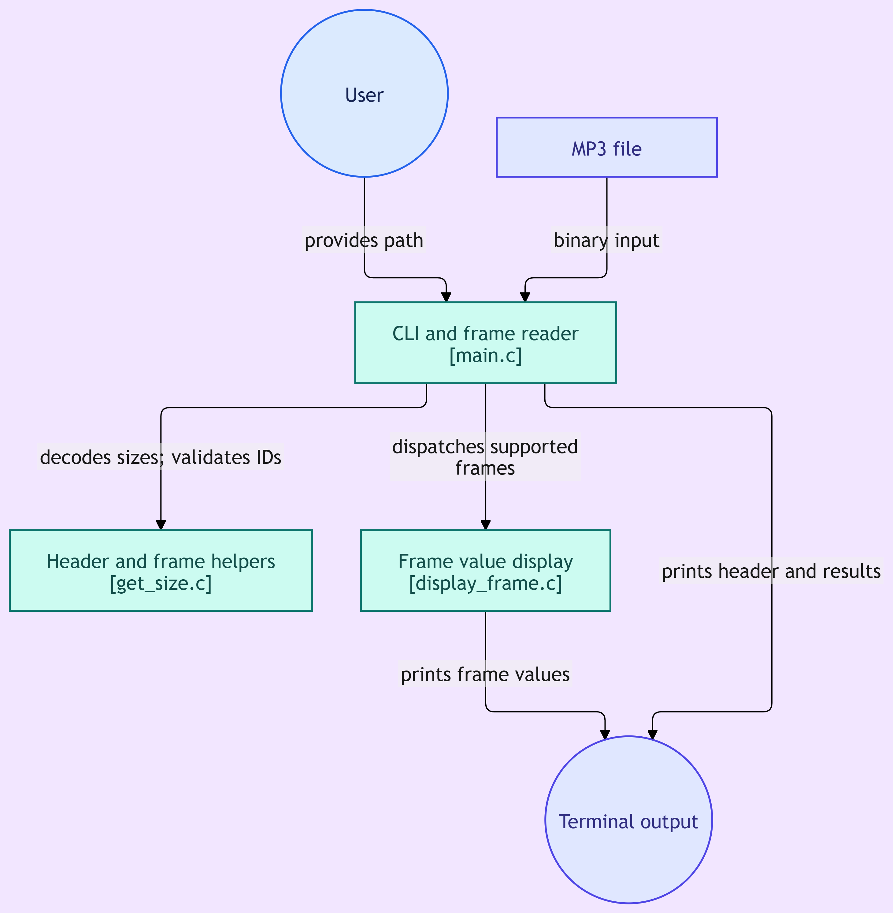

# MP3 Tag Reader

A terminal-based MP3 Tag Reader developed in C.

The project reads and displays metadata stored in MP3 files using ID3v2.3 tags.

## Features

- Read ID3v2.3 tags
- Read and validate the ID3 header
- Parse ID3 frame information
- Display song title
- Display artist
- Display album
- Display year
- Display genre
- Read TXXX user-defined text frames
- Process MP3 files using binary file handling

## Program Flow

The following diagram illustrates the flow of the MP3 Tag Reader program.



## Project Structure

```text
MP3-Tag-Reader/

│
├── main.c
├── mp3tag.c
├── mp3tag.h
└── README.md
```

## Compilation

Compile all C source files using GCC:

```bash
gcc *.c -o mp3reader
```

## Run

Run the program by providing an MP3 file as a command-line argument:

```bash
./mp3reader song.mp3
```

## How to Use

1. Compile the source files using GCC.
2. Run the program with an MP3 file.
3. The program checks for an ID3 tag.
4. The ID3 header information is read.
5. The program reads the tag frames.
6. Metadata such as title, artist, album, year, and genre is displayed.

## ID3v2.3 Frame Support

The project currently handles commonly used text frames such as:

- TIT2 - Title
- TPE1 - Artist
- TALB - Album
- TDRC - Recording Date
- TCON - Genre
- TXXX - User Defined Text

## Concepts Practiced

This project was developed to practice:

- C Programming
- Structures
- Arrays
- Pointers
- Functions
- File Handling
- Binary File Handling
- Command Line Arguments
- Bitwise Operations
- String Handling
- Modular Programming

## Requirements

- GCC Compiler
- Linux / WSL / Unix-like environment
- MP3 file with ID3 metadata

## Learning

This project helped me understand how metadata is stored inside binary files and how ID3 tags and frames can be parsed using C.

## Author

**Kushal M**